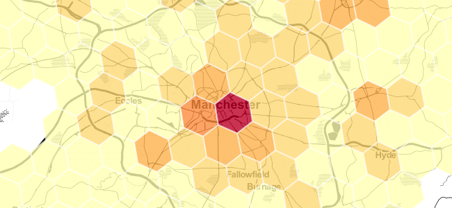

<!-- README.md is generated from README.Rmd. Please edit that file -->
h3forr
======

[](https://travis-ci.org/crazycapivara/h3forr) [](https://www.repostatus.org/#active)

Provides R bindings for [H3](https://uber.github.io/h3/), a hexagonal hierarchical spatial indexing system.



Installation
------------

You can install h3forr from github with:

``` r
# install.packages("devtools")
devtools::install_github("crazycapivara/h3forr")
```

Quickstart
----------

Core functions:

``` r
library(h3forr)

# Convert a lat/lng point to a hexagon index at resolution 7
coords <- c(37.3615593, -122.0553238)

(h3_index <- geo_to_h3(coords, res = 7))
#> [1] "87283472bffffff"

# Get the center of the hexagon
h3_to_geo(h3_index)
#> [1]   37.35172 -122.05033

# Get the vertices of the hexagon
h3_to_geo_boundary(h3_index, format_as_geojson = FALSE)
#>          [,1]      [,2]
#> [1,] 37.34110 -122.0416
#> [2,] 37.35290 -122.0340
#> [3,] 37.36352 -122.0428
#> [4,] 37.36234 -122.0591
#> [5,] 37.35054 -122.0666
#> [6,] 37.33992 -122.0579
```

Useful algorithms:

``` r
(neighbors <- k_ring(h3_index, ring_size = 1))
#> [1] "87283472bffffff" "87283472affffff" "87283470cffffff" "87283470dffffff"
#> [5] "872834776ffffff" "872834729ffffff" "872834728ffffff"

h3_to_geo_boundary(neighbors) %>%
  geo_boundary_to_sf()
#> Simple feature collection with 7 features and 0 fields
#> geometry type:  POLYGON
#> dimension:      XY
#> bbox:           xmin: -122.0917 ymin: 37.3175 xmax: -122.009 ymax: 37.38593
#> epsg (SRID):    4326
#> proj4string:    +proj=longlat +datum=WGS84 +no_defs
#>                                .
#> 1 POLYGON ((-122.041561351643...
#> 2 POLYGON ((-122.016505706738...
#> 3 POLYGON ((-122.01773574187 ...
#> 4 POLYGON ((-122.042796660949...
#> 5 POLYGON ((-122.066617540274...
#> 6 POLYGON ((-122.065377477739...
#> 7 POLYGON ((-122.040326560843...

h3_set_to_multi_polygon(neighbors)
#>            [,1]     [,2]
#>  [1,] -122.0165 37.33165
#>  [2,] -122.0090 37.34345
#>  [3,] -122.0177 37.35407
#>  [4,] -122.0102 37.36587
#>  [5,] -122.0190 37.37649
#>  [6,] -122.0353 37.37531
#>  [7,] -122.0440 37.38593
#>  [8,] -122.0603 37.38475
#>  [9,] -122.0679 37.37295
#> [10,] -122.0842 37.37177
#> [11,] -122.0917 37.35997
#> [12,] -122.0829 37.34936
#> [13,] -122.0904 37.33756
#> [14,] -122.0817 37.32694
#> [15,] -122.0654 37.32812
#> [16,] -122.0566 37.31750
#> [17,] -122.0403 37.31868
#> [18,] -122.0328 37.33048
#> [19,] -122.0165 37.33165
#> attr(,"class")
#> [1] "matrix"         "lng_lat_closed"
```
